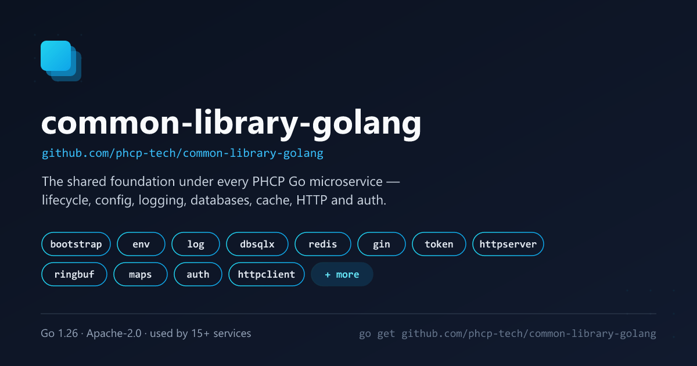

# PHCP: common-library-golang

[](https://pkg.go.dev/github.com/phcp-tech/common-library-golang)
[](https://github.com/phcp-tech/common-library-golang/blob/main/LICENSE)

[](https://app.codecov.io/gh/phcp-tech/common-library-golang)



Common-library-golang is a collection of functional components used within the PHCP ecosystem, providing numerous components for microservice development, it provides some out-of-the-box functions, such as environment, log, database, etc. To make it more widely available, it is now open-sourced under the Apache license.

## Requirements

- Go 1.25+

## Installation

```bash
go get github.com/phcp-tech/common-library-golang
```

## Build and Test

```bash
go mod tidy
go vet ./...
go build ./...
```

### Short mode test — fast CI verification

Some tests start a real TCP listener (e.g. `httpserver` integration tests). Pass
`-short` to skip them and keep the test run lightweight:

```bash
go test ./... -short
```

### Full test run — including integration tests

```bash
go test ./...
```

### Run test with coverage

```bash
# All packages
go test ./... -cover -timeout 60s

```

## Packages

| Group | Package | Import path | Description |
|-------|---------|-------------|-------------|
| Basic | [`env`](#env--configuration-management) | `.../common-library-golang/env` | TOML config + environment variable loader |
| Basic | [`log`](#log--structured-logging) | `.../common-library-golang/log` | Structured JSON logger with file rotation and ringbuf |
| Basic | [`health`](#health--composable-health-checks) | `.../common-library-golang/health` | Composable health-check aggregator for `/health` endpoints |
| Basic | [`version`](#version--application-version-metadata) | `.../common-library-golang/version` | Application version and build metadata for `/version` endpoints |
| Basic | [`shutdown`](#shutdown--graceful-shutdown) | `.../common-library-golang/shutdown` | Block until OS signal or programmatic trigger, then continue for cleanup |
| Basic | [`ringbuf`](#ringbuf--ring-buffers) | `.../common-library-golang/ringbuf` | Lock-free ring buffers (SPSC and MPSC) |
| Basic | [`maps`](#maps--thread-safe-concurrent-maps) | `.../common-library-golang/maps` | Thread-safe generic concurrent maps with pluggable replacement strategies |
| Basic | [`cgroup`](#cgroup--linux-resource-limits) | `.../common-library-golang/cgroup` | Read CPU and memory resource limits from cgroup v2 (Linux only; returns 0 on other platforms) |
| Basic | [`metrics`](#metrics--runtime-metrics-snapshot) | `.../common-library-golang/metrics` | Runtime and system metrics snapshot (CPU, memory, goroutines, cgroup limits, uptime) |
| Bootstrap | [`bootstrap`](#bootstrap--application-lifecycle-orchestrator) | `.../common-library-golang/bootstrap` | Sequential Init + LIFO Close orchestrator; 1st `Add()` = env, 2nd `Add()` = log (convention) |
| Bootstrap | [`env/component`](#bootstrap-component-packages) | `.../common-library-golang/env/component` | `IComponent` adapter for the `env` package |
| Bootstrap | [`log/component`](#bootstrap-component-packages) | `.../common-library-golang/log/component` | `IComponent` adapter for the `log` package |
| Bootstrap | [`auth/component`](#bootstrap-component-packages) | `.../common-library-golang/auth/component` | `IComponent` adapter for the `auth` (casbin) package |
| Bootstrap | [`token/component`](#bootstrap-component-packages) | `.../common-library-golang/token/component` | `IComponent` adapter for the `token` (JWT) package; fails Init if jwt.issuer or jwt.access.secretcode is unset/placeholder, or if jwt.refresh.secretcode is explicitly declared but left at its placeholder |
| Bootstrap | [`gin/component`](#bootstrap-component-packages) | `.../common-library-golang/gin/component` | `IComponent` adapter for the `gin` engine |
| Bootstrap | [`redis/component`](#bootstrap-component-packages) | `.../common-library-golang/redis/component` | `IComponent` adapter for the `redis` package |
| Bootstrap | [`dbgorm/clickhouse/component`](#bootstrap-component-packages) | `.../common-library-golang/dbgorm/clickhouse/component` | `IComponent` adapter for the GORM ClickHouse connection (pings on Init) |
| Bootstrap | [`dbgorm/mysql/component`](#bootstrap-component-packages) | `.../common-library-golang/dbgorm/mysql/component` | `IComponent` adapter for the GORM MySQL connection (pings on Init) |
| Bootstrap | [`dbgorm/postgres/component`](#bootstrap-component-packages) | `.../common-library-golang/dbgorm/postgres/component` | `IComponent` adapter for the GORM PostgreSQL connection (pings on Init) |
| Bootstrap | [`dbgorm/sqlite/component`](#bootstrap-component-packages) | `.../common-library-golang/dbgorm/sqlite/component` | `IComponent` adapter for the GORM SQLite connection |
| Bootstrap | [`dbsqlc/mysql/component`](#bootstrap-component-packages) | `.../common-library-golang/dbsqlc/mysql/component` | `IComponent` adapter for the MySQL connection (sql.Open, lazy) |
| Bootstrap | [`dbsqlc/postgres/component`](#bootstrap-component-packages) | `.../common-library-golang/dbsqlc/postgres/component` | `IComponent` adapter for the PostgreSQL pool |
| Bootstrap | [`dbsqlc/sqlite/component`](#bootstrap-component-packages) | `.../common-library-golang/dbsqlc/sqlite/component` | `IComponent` adapter for the SQLite connection |
| Bootstrap | [`dbsqlx/clickhouse/component`](#bootstrap-component-packages) | `.../common-library-golang/dbsqlx/clickhouse/component` | `IComponent` adapter for the sqlx ClickHouse connection (pings on Init) |
| Bootstrap | [`dbsqlx/clickhouse-native/component`](#bootstrap-component-packages) | `.../common-library-golang/dbsqlx/clickhouse-native/component` | `IComponent` adapter for the native-driver ClickHouse connection (lazy open) |
| Bootstrap | [`dbsqlx/mysql/component`](#bootstrap-component-packages) | `.../common-library-golang/dbsqlx/mysql/component` | `IComponent` adapter for the sqlx MySQL connection (pings on Init) |
| Bootstrap | [`dbsqlx/postgres/component`](#bootstrap-component-packages) | `.../common-library-golang/dbsqlx/postgres/component` | `IComponent` adapter for the sqlx PostgreSQL connection (pings on Init) |
| Bootstrap | [`dbsqlx/sqlite/component`](#bootstrap-component-packages) | `.../common-library-golang/dbsqlx/sqlite/component` | `IComponent` adapter for the sqlx SQLite connection |
| Bootstrap | [`httpserver/component`](#bootstrap-component-packages) | `.../common-library-golang/httpserver/component` | `IComponent` adapter for the HTTP server; `ComponentWithRunner` for custom runner injection |
| Bootstrap | [`httpserver/componentwithlambda`](#bootstrap-component-packages) | `.../common-library-golang/httpserver/componentwithlambda` | `IComponent` adapter with AWS Lambda support; selects runner via `app.runmode` |
| Database | [`redis`](#redis--redis-client) | `.../common-library-golang/redis` | Redis client (standalone and cluster) with connection pool and key scan utilities |
| Database | [`dbgorm/clickhouse`](#dbgormclickhouse--gorm-clickhouse) | `.../common-library-golang/dbgorm/clickhouse` | ClickHouse via GORM — eager ping on Open, shared process-wide `*gorm.DB` |
| Database | [`dbgorm/mysql`](#dbgormmysql--gorm-mysql) | `.../common-library-golang/dbgorm/mysql` | MySQL via GORM — eager ping on Open, shared process-wide `*gorm.DB` |
| Database | [`dbgorm/postgres`](#dbgormpostgres--gorm-postgresql) | `.../common-library-golang/dbgorm/postgres` | PostgreSQL via GORM — eager ping on Open, shared process-wide `*gorm.DB` |
| Database | [`dbgorm/sqlite`](#dbgormsqlite--gorm-sqlite) | `.../common-library-golang/dbgorm/sqlite` | SQLite via GORM — embedded, no network, file auto-created on Open |
| Database | [`dbgorm/sqlite/vfs`](#dbgormsqlitevfs--gorm-embedded-sqlite-via-vfs) | `.../common-library-golang/dbgorm/sqlite/vfs` | SQLite via GORM over embedded FS — binary-embedded read-only databases |
| Database | [`dbsqlc/mysql`](#dbsqlcmysql--mysql-connection) | `.../common-library-golang/dbsqlc/mysql` | MySQL connection via standard `database/sql` and go-sql-driver |
| Database | [`dbsqlc/postgres`](#dbsqlcpostgres--postgresql-connection-pool) | `.../common-library-golang/dbsqlc/postgres` | PostgreSQL connection pool via pgx/v5 |
| Database | [`dbsqlc/sqlite`](#dbsqlcsqlite--sqlite-connection) | `.../common-library-golang/dbsqlc/sqlite` | SQLite connection via pure-Go modernc driver |
| Database | [`dbsqlc/sqlite/vfs`](#dbsqlcsqlitevfs--embedded-sqlite-via-vfs) | `.../common-library-golang/dbsqlc/sqlite/vfs` | SQLite over embedded FS via VFS (binary-embedded databases) |
| Database | [`dbsqlx/clickhouse`](#dbsqlxclickhouse--sqlx-clickhouse) | `.../common-library-golang/dbsqlx/clickhouse` | ClickHouse via sqlx (clickhouse-go/v2 database/sql driver) — eager ping on Open, shared process-wide `*sqlx.DB` |
| Database | [`dbsqlx/clickhouse-native`](#dbsqlxclickhouse-native--clickhouse-native-driver) | `.../common-library-golang/dbsqlx/clickhouse-native` | ClickHouse native TCP client via clickhouse-go/v2 — returns `driver.Conn`, not `*sqlx.DB` |
| Database | [`dbsqlx/mysql`](#dbsqlxmysql--sqlx-mysql) | `.../common-library-golang/dbsqlx/mysql` | MySQL via sqlx — eager ping on Open, shared process-wide `*sqlx.DB` |
| Database | [`dbsqlx/postgres`](#dbsqlxpostgres--sqlx-postgresql) | `.../common-library-golang/dbsqlx/postgres` | PostgreSQL via sqlx (pgx stdlib driver) — eager ping + `SHOW search_path` on Open |
| Database | [`dbsqlx/sqlite`](#dbsqlxsqlite--sqlx-sqlite) | `.../common-library-golang/dbsqlx/sqlite` | SQLite via sqlx — embedded, no network, file auto-created on Open |
| Database | [`dbsqlx/sqlite/vfs`](#dbsqlxsqlitevfs--sqlx-embedded-sqlite-via-vfs) | `.../common-library-golang/dbsqlx/sqlite/vfs` | SQLite via sqlx over embedded FS — binary-embedded read-only databases |
| Network | [`network`](#network--network-utilities) | `.../common-library-golang/network` | Network utilities helpers |
| Network | [`auth`](#auth--casbin-rbac-authorisation) | `.../common-library-golang/auth` | Casbin RBAC authorisation middleware for Gin |
| Network | [`token`](#token--jwt-authentication) | `.../common-library-golang/token` | JWT access/refresh token creation, parsing, and Gin middleware |
| Network | [`gin`](#gin--gin-engine-factory) | `.../common-library-golang/gin` | Gin engine factory with slog request logging and CORS |
| Network | [`gin/pprof`](#ginpprof--profiling-endpoints) | `.../common-library-golang/gin/pprof` | Optional pprof profiling endpoints for Gin (explicit opt-in) |
| Network | [`httpclient`](#httpclient--resty-http-client) | `.../common-library-golang/httpclient` | Resty-based HTTP client with retry, JWT auth, and JSON helpers |
| Network | [`httpclient/retryable`](#httpclientretryable--retryable-http-client) | `.../common-library-golang/httpclient/retryable` | hashicorp/go-retryablehttp wrapper returning standard *http.Client |
| Network | [`httpserver`](#httpserver--production-httphttps-server) | `.../common-library-golang/httpserver` | Production HTTP/HTTPS server with timeouts and graceful shutdown |
| Network | [`httpserver/lambda`](#httpserverlambda--aws-lambda-adapter) | `.../common-library-golang/httpserver/lambda` | AWS Lambda adapter implementing httpserver.IRunner (explicit opt-in) |

---

## env — Configuration Management

Loads a TOML config file and merges OS environment variables on top.
Built on [koanf](https://github.com/knadh/koanf). Implements the singleton pattern:
only the first `InitEnv` call takes effect.

```go
import "github.com/phcp-tech/common-library-golang/env"

// Call once at startup before any Env() usage.
if err := env.InitEnv("config.toml"); err != nil {
    log.Fatal(err)
}

host := env.Env().String("server.host")
port := env.Env().Int("server.port")
```

For single-binary deployments the config file can be embedded at compile time:

```go
//go:embed config.toml
var configFS embed.FS

env.InitEnv("config.toml", &configFS)
```

See [full examples](https://pkg.go.dev/github.com/phcp-tech/common-library-golang/env#pkg-examples).

---

## log — Structured Logging

Structured JSON logging via `log/slog` with UTC timestamps.
File writes are fully **asynchronous**: the caller returns immediately after pushing the formatted entry into an internal `RingMPSC` buffer; a dedicated consumer goroutine performs the actual I/O. This makes the package suitable for **high-throughput, latency-sensitive scenarios** where blocking on disk I/O is unacceptable.

**`InitLog` must be called once at application startup before any log function.**
Omit the argument for stdout output at INFO level; pass a `Config` to customise.

```go
import "github.com/phcp-tech/common-library-golang/log"

// Stdout mode at default INFO level.
log.InitLog()
log.Info("application started")
log.Infof("listening on port %d", 8080)
log.InfoWith("request", "method", "GET", "path", "/api/v1", "status", 200)

// Stdout mode with custom level.
log.InitLog(&log.Config{Level: "debug"})

// File mode: set FilePath to enable rotating file logging.
log.InitLog(&log.Config{
    Level:      "info",
    FilePath:   "/var/log/app.log",
    MaxSizeMB:  100,
    MaxBackups: 7,
    MaxAgeDays: 30,
    Compress:   true,
})
defer log.Close() // flush async buffer and close file on shutdown
```

Available log functions: `Debug` / `Info` / `Warn` / `Error` and their `f` (format) and `With` (structured key-value) variants. Log level can be changed at runtime with `SetLevel`.

See [full examples](https://pkg.go.dev/github.com/phcp-tech/common-library-golang/log#pkg-examples).

---

## health — Composable Health Checks

Interface-based health-check aggregator for `/health` HTTP endpoints.
Each infrastructure package supplies a `Checker` that owns its own component
name and reachability status; `Check` runs all checkers and returns their
combined results.

```go
import (
    "github.com/phcp-tech/common-library-golang/health"
    db    "github.com/phcp-tech/common-library-golang/dbsqlc/postgres"
    cache "github.com/phcp-tech/common-library-golang/redis"
)

// Compose any number of checkers in a /health handler.
router.GET("/health", func(c *gin.Context) {
    c.JSON(http.StatusOK, health.Check(
        c.Request.Context(),
        db.HealthChecker(),
        cache.HealthChecker(),
    ))
})
// JSON response: [{"name":"postgres","status":1},{"name":"redis","status":1}]
```

| Constant | Value | Meaning |
|---|---|---|
| `health.StatusHealthy` | `1` | Component is reachable |
| `health.StatusUnhealthy` | `0` | Component is unreachable or not initialised |

See [full examples](https://pkg.go.dev/github.com/phcp-tech/common-library-golang/health#pkg-examples).

---

## version — Application Version Metadata

Returns application version and build metadata for `/version` HTTP endpoints.
Reads `app.name`, `app.version`, and `app.env.value` from `env.Env()`, and
populates `GoVersion` / `BuildInfo` from the embedded Go build info.
Requires `env.InitEnv` to be called at application startup.

```go
import "github.com/phcp-tech/common-library-golang/version"

router.GET("/version", func(c *gin.Context) {
    c.JSON(http.StatusOK, version.Get())
})
// JSON response:
// {
//   "name": "my-service",
//   "version": "1.2.3",
//   "environment": "production",
//   "goVersion": "go1.26.1",
//   "buildInfo": "v1.2.3"
// }
```

See [full examples](https://pkg.go.dev/github.com/phcp-tech/common-library-golang/version#pkg-examples).

---

## shutdown — Graceful Shutdown

Two primitives for application shutdown coordination:

- **`Wait`** blocks the calling goroutine until an OS signal (`SIGINT`, `SIGTERM`, `SIGHUP`, `SIGQUIT`) or `Trigger` is called. After it returns, the caller performs cleanup and exits.
- **`Trigger`** unblocks `Wait` programmatically from any goroutine — useful for a `/shutdown` HTTP endpoint or a metrics failure handler. Safe to call multiple times.

```go
import "github.com/phcp-tech/common-library-golang/shutdown"

// In main: start services, then block until shutdown.
shutdown.Wait()

// Cleanup runs here (or via defer before Wait).
runner.Shutdown(ctx)
```

```go
// From a /shutdown HTTP endpoint or metrics failure handler.
shutdown.Trigger()
```

> **Note:** `Trigger` has no effect when the process is forcibly terminated by the OS
> (e.g. IDE stop button on Windows calls `TerminateProcess` — no signal is delivered).

See [full examples](https://pkg.go.dev/github.com/phcp-tech/common-library-golang/shutdown#pkg-examples).

---

## ringbuf — Ring Buffers

High-performance fixed-capacity ring buffers for producer-consumer pipelines.

| Type | Use case | Thread safety |
|------|----------|---------------|
| `RingSPSC` | Single producer, single consumer | Lock-free (atomic only) |
| `RingMPSC` | Multiple producers, single consumer | Mutex on producer side |

Both types support an optional `ProcessFunc` that starts a consumer goroutine
automatically, or manual `Pop` / `TryPop` for caller-managed consumption.
`Push` blocks when the buffer is full (backpressure); `TryPush` returns false
immediately.

```go
import "github.com/phcp-tech/common-library-golang/ringbuf"

// SPSC — single producer, automatic consumer goroutine
rb := ringbuf.NewRingSPSC(ringbuf.RingSPSCConfig[string]{
    Capacity:    1024,
    ProcessFunc: func(s string) { fmt.Println(s) },
})
rb.Push("hello")
rb.Close() // drain and wait for consumer to finish

// MPSC — multiple producers, automatic consumer goroutine
rb := ringbuf.NewRingMPSC(ringbuf.RingMPSCConfig[[]byte]{
    Capacity:    4096,
    ProcessFunc: func(b []byte) { os.Stdout.Write(b) },
})
```

See [full examples](https://pkg.go.dev/github.com/phcp-tech/common-library-golang/ringbuf#pkg-examples).

### Performance

Benchmarks run with `go test -bench=. -benchtime=3s -benchmem`.
All operations produce **zero heap allocations**.

**Test environment**

| | |
|---|---|
| CPU | 11th Gen Intel® Core™ i7-11850H @ 2.50 GHz (8 cores / 16 threads) |
| RAM | 32 GB |
| OS | Windows 11 Enterprise |
| Go | 1.26.2 windows/amd64 |

**Results**

| Benchmark | ns/op | Throughput | Allocs |
|-----------|------:|----------:|-------:|
| `SPSC Push` (1P-1C, blocking) | 76.65 | ~13.0 M ops/s | 0 |
| `SPSC TryPush` (1P-1C, non-blocking) | 87.91 | ~11.4 M ops/s | 0 |
| `SPSC ProducerConsumer` (end-to-end with ProcessFunc) | 83.72 | ~11.9 M ops/s | 0 |
| `SPSC Push string` (realistic log payload) | 91.06 | ~11.0 M ops/s | 0 |
| `MPSC Push` (1 producer) | 151.1 | ~6.6 M ops/s | 0 |
| `MPSC Push` (4 producers concurrent) | 192.2 | ~5.2 M ops/s | 0 |
| `MPSC Push` (8 producers concurrent) | 200.7 | ~5.0 M ops/s | 0 |
| `MPSC ProducerConsumer` (4P end-to-end) | 197.5 | ~5.1 M ops/s | 0 |
| `Go channel` (buffered 4096, reference) | 126.3 | ~7.9 M ops/s | 0 |

**Key observations**

- SPSC is **~1.6× faster** than a buffered Go channel for the same single-producer / single-consumer pattern.
- MPSC trades some throughput for multi-producer safety via a mutex; with 8 concurrent producers it remains above **5 M ops/s**.
- Throughput scales gracefully under producer contention: going from 1 to 8 producers adds only ~33% latency per item.
- Both types maintain **zero allocations per operation**, making them suitable as the async I/O backbone for the `log` package.

---

## maps — Thread-Safe Concurrent Maps

Thread-safe generic concurrent maps backed by
[orcaman/concurrent-map](https://github.com/orcaman/concurrent-map) with
pluggable replacement strategies.

Two implementations are provided:

| Type | Key | Value | Strategy |
|------|-----|-------|----------|
| `CMap` | `string` (fixed) | `int64` (fixed) | Greater-value wins (built-in) |
| `CMapGen[K, V]` | any `comparable` | any | Unconfigured: always overwrites. Configurable via `SetDefaultCompare` or `SetDefaultStrategy` |

Built-in strategy types: `NumericGreaterStrategy[V cmp.Ordered]` (real numeric/ordered comparison — requires `V` to satisfy `cmp.Ordered`), `AlwaysReplaceStrategy`, `TimestampStrategy`. Until `SetDefaultCompare`/`SetDefaultStrategy` is called, `CMapGen.Replace` behaves like `ReplaceAlways` — `V` is unconstrained, so there is no strategy that can be wired up automatically for an arbitrary type.

```go
import "github.com/phcp-tech/common-library-golang/maps"

// Generic map — configure a default compare function.
m := maps.NewCMapGen[string, int64]()
m.SetDefaultCompare(func(old, new int64) bool { return new > old })

m.Set("EURUSD", 10500)
m.Replace("EURUSD", 10600)       // stored: 10600 > 10500
m.ReplaceAlways("EURUSD", 9000)  // always stored
m.ReplaceIfNotExists("GBPUSD", 12800) // stored only if key absent

// Read-modify-write via callback (not atomic for concurrent writes to the same key — see below).
m.UpsertWithCallback("USDJPY", 15100, func(exists bool, old, new int64) int64 {
    if !exists || new > old { return new }
    return old
})

// Fixed string→int64 map (no configuration needed).
cm := maps.NewCMap()
cm.Set("tick", 10000)
cm.Replace("tick", 10050) // stored: 10050 > 10000
```

`Replace`/`ReplaceWithCompare`/`ReplaceWithStrategy`/`UpsertWithCallback` all read the old value and write the new one as two separately-locked operations, not one atomic operation — safe under concurrent writes to *different* keys, and safe (no corruption/panic) even under concurrent writes to the *same* key, but the value left standing after a race is whichever `Set` executed last, not necessarily the one the compare/strategy/callback logic says should have won. For a true atomic read-modify-write on a single key, call the underlying `cmap.ConcurrentMap.Upsert` directly — it holds the shard lock for the whole callback.

See [full examples](https://pkg.go.dev/github.com/phcp-tech/common-library-golang/maps#pkg-examples).

### Performance

Benchmarks run with `go test -bench=. -benchtime=3s -benchmem`.

**Test environment** — same machine as ringbuf benchmarks:
Intel® Core™ i7-11850H @ 2.50 GHz · 8 cores / 16 threads · 32 GB RAM · Go 1.26.2 / Windows 11

**CMap** (fixed `string→int64`, built-in greater-value strategy)

| Benchmark | ns/op | Throughput | B/op | Allocs |
|-----------|------:|----------:|-----:|-------:|
| `Set` | 27.51 | ~36.3 M ops/s | 0 | 0 |
| `Get` | 15.70 | ~63.7 M ops/s | 0 | 0 |
| `Replace` | 43.99 | ~22.7 M ops/s | 0 | 0 |
| `Set` (parallel, 16 goroutines) | 70.82 | ~14.1 M ops/s | 0 | 0 |
| `Replace` (parallel, 16 goroutines) | 151.5 | ~6.6 M ops/s | 0 | 0 |

**CMapGen** (generic `[K comparable, V any]`)

| Benchmark | ns/op | Throughput | B/op | Allocs | Note |
|-----------|------:|----------:|-----:|-------:|------|
| `Set` | 31.75 | ~31.5 M ops/s | 0 | 0 | |
| `Get` | 18.20 | ~55.0 M ops/s | 0 | 0 | |
| `Replace` (`NumericGreaterStrategy`, explicitly configured) | 47.63 | ~21.0 M ops/s | 0 | 0 | |
| `ReplaceWithCompare` | 46.32 | ~21.6 M ops/s | 0 | 0 | |
| `ReplaceAlways` | 30.05 | ~33.3 M ops/s | 0 | 0 | |
| `UpsertWithCallback` | 49.29 | ~20.3 M ops/s | 0 | 0 | |
| `Set` (parallel, 16 goroutines) | 71.17 | ~14.1 M ops/s | 0 | 0 | |
| `Replace` (parallel, 16 goroutines) | 167.9 | ~6.0 M ops/s | 0 | 0 | |
| Mixed read/write (parallel) | 25.96 | ~38.5 M ops/s | 0 | 0 | |

**`sync.Map`** (stdlib reference)

| Benchmark | ns/op | Throughput | B/op | Allocs |
|-----------|------:|----------:|-----:|-------:|
| `Store` | 60.90 | ~16.4 M ops/s | 56 | 1 |
| `Load` | 10.48 | ~95.4 M ops/s | 0 | 0 |
| `Store` (parallel, 16 goroutines) | 110.0 | ~9.1 M ops/s | 56 | 1 |

**Key observations**

- `CMap.Set` is **~2.2× faster** than `sync.Map.Store` and allocates nothing.
- `CMapGen.Replace` is zero-allocation whether it's driven by an explicitly configured `NumericGreaterStrategy`/`SetDefaultStrategy`, `SetDefaultCompare`, or left unconfigured (in which case it behaves like `ReplaceAlways`, also zero-allocation) — there is no default path that falls back to string formatting.
- `CMapGen.ReplaceAlways` is the fastest write path (~33.3 M ops/s) when no conditional logic is needed.
- Under 16-goroutine parallel write contention `CMap.Replace` degrades to ~6.6 M ops/s due to single-key hot-spot; spreading writes across many keys restores throughput.

---

## cgroup — Linux Resource Limits

Reads CPU and memory resource limits from the **cgroup v2** unified hierarchy
(`/sys/fs/cgroup`). Intended for containerised workloads (Kubernetes, Docker)
where the process runs inside a cgroup with configured CPU and memory constraints.

On **non-Linux platforms** (macOS, Windows) all functions return `(0, nil)` — no
cgroup filesystem is available and no error is raised.

| Function | cgroup v2 file | Returns |
|----------|---------------|---------|
| `CPULimitMilli()` | `cpu.max` | CPU limit in millicores; 0 = unlimited |
| `CPURequestMilli()` | `cpu.weight` | CPU request in millicores via weight→shares→mCPU |
| `MemoryLimitBytes()` | `memory.max` | Memory limit in bytes; 0 = unlimited |
| `MemoryRequestBytes()` | `memory.low` | Memory soft limit in bytes; 0 = not set |

```go
import "github.com/phcp-tech/common-library-golang/cgroup"

// Read CPU limit and cap GOMAXPROCS accordingly.
if milli, err := cgroup.CPULimitMilli(); err == nil && milli > 0 {
    cpus := milli / 1000
    if cpus < 1 {
        cpus = 1
    }
    runtime.GOMAXPROCS(cpus)
}

// Size an in-process cache as 25 % of the container memory limit.
if limitBytes, err := cgroup.MemoryLimitBytes(); err == nil && limitBytes > 0 {
    cacheBytes := limitBytes / 4
    cache.SetMaxSize(cacheBytes)
}
```
See [full examples](https://pkg.go.dev/github.com/phcp-tech/common-library-golang/cgroup#pkg-examples).

---

## metrics — Runtime Metrics Snapshot

Collects a one-shot snapshot of key runtime and system metrics as a flat
`[]NameValue` slice, suitable for a `/metrics` or `/health` HTTP endpoint.

Each call samples **CPU usage over one second** via `gopsutil`, so it is
intended for periodic polling (e.g. every 10–30 s), not hot-path use.

| Metric name | Description |
|-------------|-------------|
| `cpuPercent` | Process CPU usage (%) across all cores, sampled over 1 s |
| `memorySize` | Resident set size (RSS) in MiB |
| `threads` | OS thread count |
| `goroutines` | Live goroutine count |
| `gomaxprocs` | `runtime.GOMAXPROCS(0)` |
| `numCPU` | `runtime.NumCPU()` |
| `cpuRequest` | cgroup v2 CPU request in millicores (0 if not set or non-Linux) |
| `cpuLimit` | cgroup v2 CPU limit in millicores (0 if unlimited or non-Linux) |
| `memoryRequest` | cgroup v2 memory soft limit in bytes (0 if not set or non-Linux) |
| `memoryLimit` | cgroup v2 memory limit in bytes (0 if unlimited or non-Linux) |
| `age` | Process uptime formatted as `Xd Xh Xm Xs` |

```go
import "github.com/phcp-tech/common-library-golang/metrics"

// Periodic metrics poll — call from a background goroutine.
snapshot := metrics.GetMetrics()

// Look up a specific entry.
for _, nv := range snapshot {
    if nv.Name == "goroutines" {
        slog.Info("runtime", "goroutines", nv.Value)
    }
}

// Serialize to JSON for a /health endpoint.
b, _ := json.Marshal(snapshot)
w.Write(b)
```

See [full examples](https://pkg.go.dev/github.com/phcp-tech/common-library-golang/metrics#pkg-examples).

---

## bootstrap — Application Lifecycle Orchestrator

`bootstrap` orchestrates the sequential initialization and LIFO cleanup of application components at startup.

> **Component registration order convention**
>
> The **first** `Add()` call MUST register the **env** component.
> The **second** `Add()` call MUST register the **log** component.
> All subsequent calls (`Add`, `AddParallel`, `PreReady`) are free.
>
> This convention exists because:
> - every component's `Init()` reads configuration via `env.Env()`, so env must initialize first;
> - Go's `slog` package has a usable default instance from program start (writes to stderr), so
>   `Init()` failures at any stage — including before `log.Init()` — are captured by `slog`;
> - `env.Close()` is a no-op, so LIFO naturally makes `log.Close()` the last meaningful shutdown operation.

```go
import (
    "github.com/phcp-tech/common-library-golang/bootstrap"
    envComp  "github.com/phcp-tech/common-library-golang/env/component"
    logComp  "github.com/phcp-tech/common-library-golang/log/component"
    dbComp   "github.com/phcp-tech/common-library-golang/dbsqlc/postgres/component"
    ginComp  "github.com/phcp-tech/common-library-golang/gin/component"
    httpComp "github.com/phcp-tech/common-library-golang/httpserver/component"
)

func main() {
    var router *gin.Engine
    bootstrap.New().
        Add(envComp.Component("config/app.toml", &configFS)). // 1st — MUST be env
        Add(logComp.Component()).                              // 2nd — MUST be log
        AddParallel(dbComp.Component()).
        PreReady(migrate).
        PreReady(initServices).
        Add(ginComp.Component(func(r *gin.Engine) { router = r; mount(r) })).
        Add(httpComp.Component(func() http.Handler { return router })).
        PostReady(func() { slog.Info("server ready") }).
        Run()
}
```

### API

| Method | Signature | Description |
|--------|-----------|-------------|
| `New` | `() *App` | Creates an empty orchestrator |
| `Add` | `(cs ...IComponent) *App` | Sequential phase: Init in registration order, Close in LIFO order. **1st call = env, 2nd call = log** |
| `AddParallel` | `(cs ...IComponent) *App` | Concurrent phase: all Init calls run in parallel; all must succeed before the next step starts |
| `PreReady` | `(fn func() error) *App` | Inline setup function in the startup sequence; non-nil error aborts startup; no Close, not tracked in LIFO |
| `PostReady` | `(fn func()) *App` | Notification hook invoked after all steps succeed; multiple calls accumulate in registration order |
| `Run` | `()` | Executes all steps, waits for SIGINT/SIGTERM, then closes in LIFO order |

### IComponent interface

```go
type IComponent interface {
    Name() string   // displayed in log messages
    Init() error    // non-nil error aborts startup and exits with code 1
    Close()         // called during shutdown in LIFO order; must never panic
}
```

Use `bootstrap.Func` to wrap a function pair as an `IComponent` when Close logic exists but no struct is needed:

```go
bootstrap.Func("worker", startWorker, stopWorker)
```

### Startup and shutdown sequence

```
New()
  → Add(env).Init   ← slog (default handler writes to stderr before log.Init)
  → Add(log).Init   ← slog
  → steps (in registration order)
        ├── stepPhase    → Init, added to closeStack
        └── stepPreReady → fn(), not added to closeStack
  → PostReady callbacks
  → wait for signal
        ↓
  ← single closeAll (LIFO)
        custom components (reverse order)
        → log.Close   (last meaningful close — env.Close is a no-op)
        → env.Close   (no-op)
```

### PreReady

`PreReady` registers a function into the startup sequence, sharing the same ordered list as `Add`/`AddParallel`. A non-nil error aborts startup identically to a failed component `Init()`. PreReady steps have no Close and do not participate in LIFO shutdown.

```go
.AddParallel(dbComp.Component()).
PreReady(migrate).        // runs after DB is ready
PreReady(initServices).   // runs after migrate
Add(ginComp.Component(mount)).
```

| | `bootstrap.Func(..., nil)` | `PreReady(fn)` |
|---|---|---|
| Appears in step list | ✓ as `stepPhase` | ✓ as `stepPreReady` |
| Participates in LIFO closeStack | ✓ (Close is a no-op) | ✗ |
| Semantic | "a component without Close" | "one-shot code in the startup sequence" |

### PostReady

`PostReady` can be called multiple times. Each call **appends** a callback; all run in registration order after every step succeeds and before the process blocks on an OS signal. Suitable for actions that do not affect request-handling correctness:

```go
.PostReady(func() { slog.Info("server ready", "addr", ":8080") }).
PostReady(func() { discovery.Register(serviceID) })
```

Code placed after `Run()` in `main`, or in a `defer` before `Run()`, executes after the full shutdown sequence completes and is suitable for post-shutdown teardown.

See [full examples](https://pkg.go.dev/github.com/phcp-tech/common-library-golang/bootstrap#pkg-examples).

---

### Bootstrap Component Packages

Each base package ships a companion `component/` sub-package that adapts it to the `IComponent` interface. Component packages read all configuration from `env.Env()` inside `Init()` — never in the constructor — so they are safe to construct before `bootstrap.New()` is called.

| Component package | Env keys read on Init |
|-------------------|-----------------------|
| `env/component` | _(none — reads the config file itself)_ |
| `log/component` | `log.level`, `log.file.path`, `log.file.max.size.mb`, `log.file.max.backups`, `log.file.max.age.days`, `log.file.compress` |
| `auth/component` | _(model and policy passed as constructor arguments)_ |
| `token/component` | `jwt.issuer` (required — must be identical across every service; Init fails if empty or `"TOBE_REPLACED"`), `jwt.access.secretcode` (required — Init fails if empty or `"TOBE_REPLACED"`), `jwt.refresh.secretcode` (optional if unset; Init fails if explicitly left at `"TOBE_REPLACED"`) |
| `gin/component` | `app.env.value`, `cors.allow.origins.prod`, `cors.allow.origins.dev` |
| `redis/component` | `redis.clusters`, `redis.database`, `redis.password` |
| `dbgorm/clickhouse/component` | `db.host`, `db.port`, `db.name`, `db.username`, `db.password`, `db.max.open.conns`, `db.max.idle.conns`, `db.conn.max.lifetime`, `db.conn.max.idletime` |
| `dbgorm/mysql/component` | `db.host`, `db.port`, `db.name`, `db.username`, `db.password`, `db.max.open.conns`, `db.max.idle.conns`, `db.conn.max.lifetime`, `db.conn.max.idletime` |
| `dbgorm/postgres/component` | `db.host`, `db.port`, `db.name`, `db.schema`, `db.username`, `db.password`, `db.max.open.conns`, `db.max.idle.conns`, `db.conn.max.lifetime`, `db.conn.max.idletime` |
| `dbgorm/sqlite/component` | `db.sqlite.path` |
| `dbsqlc/mysql/component` | `db.host`, `db.port`, `db.name`, `db.username`, `db.password`, `db.max.open.conns`, `db.max.idle.conns`, `db.conn.max.lifetime`, `db.conn.max.idletime` |
| `dbsqlc/postgres/component` | `db.host`, `db.port`, `db.name`, `db.schema`, `db.username`, `db.password`, `db.pool.*` |
| `dbsqlc/sqlite/component` | `db.sqlite.path` |
| `dbsqlx/clickhouse/component` | `db.host`, `db.port`, `db.name`, `db.username`, `db.password`, `db.max.open.conns`, `db.max.idle.conns`, `db.conn.max.lifetime`, `db.conn.max.idletime` |
| `dbsqlx/clickhouse-native/component` | `db.host`, `db.port`, `db.name`, `db.username`, `db.password`, `db.max.open.conns`, `db.max.idle.conns`, `db.conn.max.lifetime` |
| `dbsqlx/mysql/component` | `db.host`, `db.port`, `db.name`, `db.username`, `db.password`, `db.max.open.conns`, `db.max.idle.conns`, `db.conn.max.lifetime`, `db.conn.max.idletime` |
| `dbsqlx/postgres/component` | `db.host`, `db.port`, `db.name`, `db.schema`, `db.username`, `db.password`, `db.max.open.conns`, `db.max.idle.conns`, `db.conn.max.lifetime`, `db.conn.max.idletime` |
| `dbsqlx/sqlite/component` | `db.sqlite.path` |
| `httpserver/component` | `http.server.port` |
| `httpserver/componentwithlambda` | `app.runmode` (`"aws_lambda"` → Lambda runner), `http.server.port` (other modes) |

---

## redis — Redis Client

Thread-safe Redis client supporting both **standalone** and **cluster** modes,
backed by [go-redis/v9](https://github.com/redis/go-redis).
Connection pool settings (`PoolSize`, `MinIdleConns`) are configurable via `Config`
with sensible defaults (100 / 5). The caller reads values from `env.Env()` at the
composition root — this package has no dependency on env.

```go
import "github.com/phcp-tech/common-library-golang/redis"

// Standalone mode (single address).
cli := redis.NewRedisClient(&redis.Config{
    Clusters: []string{env.Env().String("redis.addr")},
    Password: env.Env().String("redis.password"),
    DB:       env.Env().Int("redis.db"),
})
defer cli.Close()

// Cluster mode — more than one address enables cluster automatically.
cli := redis.NewRedisClient(&redis.Config{
    Clusters:     env.Env().Strings("redis.clusters"),
    PoolSize:     200,
    MinIdleConns: 10,
})

// Basic operations.
cli.Set(ctx, "key", "value", 5*time.Minute)
val, err := cli.Get(ctx, "key")
cli.Del(ctx, "key")
cli.Unlink(ctx, "key") // async deletion — preferred for large keys

// Remove all keys starting with a prefix.
cli.CleanCache(ctx, "user:42:")

// Count matching keys across all nodes.
n, err := cli.GetKeysCount(ctx, "session:*")
```

Implements the singleton pattern via `InitDefault` / `Default`.

### Health check

`HealthChecker()` returns a [`health.Checker`](#health--composable-health-checks) that pings the default client.
Reports `StatusUnhealthy` when no client has been initialised or when the ping fails.

```go
import (
    "github.com/phcp-tech/common-library-golang/health"
    "github.com/phcp-tech/common-library-golang/redis"
)

results := health.Check(c.Request.Context(), redis.HealthChecker())
// → []health.Result{{Name: "redis", Status: health.StatusHealthy}}
```

See [full examples](https://pkg.go.dev/github.com/phcp-tech/common-library-golang/redis#pkg-examples).


---

## dbgorm/clickhouse — GORM ClickHouse

[GORM](https://gorm.io)-based ClickHouse adapter. GORM's driver **pings the server
during `Open`** — `InitDefault` returns a non-nil error immediately when the database
is unreachable, causing bootstrap to abort startup.
The default instance is a process-wide `*gorm.DB` shared via `dbgorm.Default()` /
`dbgorm.SetDefault()`.

> **Note:** `PrepareStmt` is automatically disabled for ClickHouse because the driver
> maps `Prepare()` to batch INSERT; it must be off for regular SELECT queries.
> This is handled transparently inside `dbgorm.Open`.

```go
import (
    dbgorm     "github.com/phcp-tech/common-library-golang/dbgorm"
    "github.com/phcp-tech/common-library-golang/dbgorm/clickhouse"
)

err := clickhouse.InitDefault(&clickhouse.Config{
    Host:     "localhost",
    Port:     "9440",   // native TCP+TLS; use 8123/8443 for HTTP
    Database: "mydb",
    Username: "user",
    Password: "pass",
})
if err != nil {
    log.Fatal(err)
}

db := dbgorm.Default() // *gorm.DB, ready for GORM operations
```

### Health check

Use [`dbgorm.HealthChecker()`](#health--composable-health-checks) from the root package —
the checker is dialect-agnostic and works with any driver initialised via `InitDefault`.

```go
import (
    dbgorm "github.com/phcp-tech/common-library-golang/dbgorm"
    "github.com/phcp-tech/common-library-golang/health"
)

results := health.Check(c.Request.Context(), dbgorm.HealthChecker())
// → []health.Result{{Name: "database", Status: health.StatusHealthy}}
```

See [full examples](https://pkg.go.dev/github.com/phcp-tech/common-library-golang/dbgorm/clickhouse#pkg-examples).

---

## dbgorm/mysql — GORM MySQL

[GORM](https://gorm.io)-based MySQL adapter. Unlike `dbsqlc/mysql`, GORM's driver
**pings the server during `Open`** — `InitDefault` returns a non-nil error immediately
when the database is unreachable, which causes bootstrap to abort startup.
The default instance is a process-wide `*gorm.DB` shared via `dbgorm.Default()` /
`dbgorm.SetDefault()` (no `sync.Once` — can be replaced at runtime).

```go
import (
    dbgorm "github.com/phcp-tech/common-library-golang/dbgorm"
    "github.com/phcp-tech/common-library-golang/dbgorm/mysql"
)

// Open and store as the process-wide default.
err := mysql.InitDefault(&mysql.Config{
    Host:     "localhost",
    Port:     "3306",
    Database: "mydb",
    Username: "user",
    Password: "pass",
})
if err != nil {
    log.Fatal(err) // server was unreachable — GORM pinged on Open
}

db := dbgorm.Default() // *gorm.DB, ready for GORM operations
```

For cases that require multiple databases, use `NewMySQL` directly and store
the returned `*gorm.DB` in explicit fields rather than the shared default.

### Health check

Use [`dbgorm.HealthChecker()`](#health--composable-health-checks) from the root package —
the checker is dialect-agnostic and works with any driver initialised via `InitDefault`.

```go
import (
    dbgorm "github.com/phcp-tech/common-library-golang/dbgorm"
    "github.com/phcp-tech/common-library-golang/health"
)

results := health.Check(c.Request.Context(), dbgorm.HealthChecker())
// → []health.Result{{Name: "database", Status: health.StatusHealthy}}
```

See [full examples](https://pkg.go.dev/github.com/phcp-tech/common-library-golang/dbgorm/mysql#pkg-examples).

---

## dbgorm/postgres — GORM PostgreSQL

[GORM](https://gorm.io)-based PostgreSQL adapter. GORM's driver **pings the server
and runs `SHOW search_path` during `Open`** — `InitDefault` returns a non-nil error
immediately when the database is unreachable, causing bootstrap to abort startup.
Supports an optional `SearchPath` for schema isolation.
The default instance is a process-wide `*gorm.DB` shared via `dbgorm.Default()` /
`dbgorm.SetDefault()`.

```go
import (
    dbgorm "github.com/phcp-tech/common-library-golang/dbgorm"
    "github.com/phcp-tech/common-library-golang/dbgorm/postgres"
)

err := postgres.InitDefault(&postgres.Config{
    Host:       "localhost",
    Port:       "5432",
    Database:   "mydb",
    Username:   "user",
    Password:   "pass",
    SearchPath: "myschema", // optional
})
if err != nil {
    log.Fatal(err) // server was unreachable
}

db := dbgorm.Default() // *gorm.DB, ready for GORM operations
```

### Health check

Use [`dbgorm.HealthChecker()`](#health--composable-health-checks) from the root package —
the checker is dialect-agnostic and works with any driver initialised via `InitDefault`.

```go
import (
    dbgorm "github.com/phcp-tech/common-library-golang/dbgorm"
    "github.com/phcp-tech/common-library-golang/health"
)

results := health.Check(c.Request.Context(), dbgorm.HealthChecker())
// → []health.Result{{Name: "database", Status: health.StatusHealthy}}
```

See [full examples](https://pkg.go.dev/github.com/phcp-tech/common-library-golang/dbgorm/postgres#pkg-examples).

---

## dbgorm/sqlite — GORM SQLite

[GORM](https://gorm.io)-based SQLite adapter backed by
[glebarez/sqlite](https://github.com/glebarez/sqlite) (pure Go, no CGO).
SQLite is an **embedded** database — no network connection is involved.
`InitDefault` opens (and auto-creates) the file; it fails only when the path is
empty or the file cannot be created. `MaxOpenConns` is fixed at 1 to prevent
`database is locked` errors under concurrent writes.

```go
import (
    dbgorm "github.com/phcp-tech/common-library-golang/dbgorm"
    "github.com/phcp-tech/common-library-golang/dbgorm/sqlite"
)

// File-based database.
err := sqlite.InitDefault(&sqlite.Config{
    Path: "file:app.db?cache=shared",
})
if err != nil {
    log.Fatal(err)
}

db := dbgorm.Default() // *gorm.DB, ready for GORM operations

// In-memory database (tests, ephemeral data).
db, _ := sqlite.NewSQLite(&sqlite.Config{
    Path: "file::memory:?cache=shared",
})
```

> **No HealthChecker:** SQLite is embedded — if it fails, the application is already broken.
> A health endpoint for an embedded database provides no operational value.

See [full examples](https://pkg.go.dev/github.com/phcp-tech/common-library-golang/dbgorm/sqlite#pkg-examples).

---

## dbgorm/sqlite/vfs — GORM Embedded SQLite via VFS

Opens a SQLite database **embedded inside the Go binary** using
[modernc.org/sqlite/vfs](https://pkg.go.dev/modernc.org/sqlite/vfs) and Go's `embed.FS`.
The embedded file must reside at `config/sqlite.db` inside the provided `embed.FS`.

**Import this sub-package only when distributing a SQLite database as part of the binary.**
For regular file-based databases use `dbgorm/sqlite` instead.

`InitDefault` uses `sync.Once` — the first call wins; subsequent calls are silently ignored.

```go
import (
    dbgorm "github.com/phcp-tech/common-library-golang/dbgorm"
    sqlvfs "github.com/phcp-tech/common-library-golang/dbgorm/sqlite/vfs"
)

//go:embed config/sqlite.db
var sqliteFS embed.FS

// Open directly (no singleton).
db, err := sqlvfs.New(&sqliteFS)

// Or store as the process-wide default (sync.Once).
if err := sqlvfs.InitDefault(&sqliteFS); err != nil {
    log.Fatal(err)
}
db := dbgorm.Default() // *gorm.DB, ready for GORM operations
```

See [full examples](https://pkg.go.dev/github.com/phcp-tech/common-library-golang/dbgorm/sqlite/vfs#pkg-examples).

---

## dbsqlc/mysql — MySQL Connection

Standard `database/sql` connection for use with [sqlc](https://sqlc.dev/) (`sql_package: "database/sql"`),
backed by [go-sql-driver/mysql](https://github.com/go-sql-driver/mysql).
Connection pool settings (`MaxOpenConns`, `MaxIdleConns`, `ConnMaxLifetime`, `ConnMaxIdletime`)
are configurable via `Config` with sensible defaults.
Implements the singleton pattern via `InitDefault` / `Default`.

> **Note:** `sql.Open` is **lazy** — no connection is established during `InitDefault`.
> `Init()` always returns nil. Use an explicit `PingContext` in a `PreReady` step
> if an eager connectivity check is required at startup.

```go
import "github.com/phcp-tech/common-library-golang/dbsqlc/mysql"

// Singleton mode: call once at startup.
err := mysql.InitDefault(&mysql.Config{
    Host:     "localhost",
    Port:     "3306",
    Database: "mydb",
    Username: "user",
    Password: "pass",
})
if err != nil {
    log.Fatal(err)
}

db := mysql.Default() // *sql.DB, pass to sqlc Queries
```

For cases that require multiple connections, use `NewMySQL` directly instead of the singleton.

### Health check

`HealthChecker()` returns a [`health.Checker`](#health--composable-health-checks) that pings the default connection.
Reports `StatusUnhealthy` when no connection has been initialised or when the ping fails.

```go
import (
    "github.com/phcp-tech/common-library-golang/health"
    "github.com/phcp-tech/common-library-golang/dbsqlc/mysql"
)

results := health.Check(c.Request.Context(), mysql.HealthChecker())
// → []health.Result{{Name: "database", Status: health.StatusHealthy}}
```

See [full examples](https://pkg.go.dev/github.com/phcp-tech/common-library-golang/dbsqlc/mysql#pkg-examples).

---

## dbsqlc/postgres — PostgreSQL Connection Pool

pgx/v5 connection pool for use with [sqlc](https://sqlc.dev/) (`sql_package: "pgx/v5"`).
Pool creation is **lazy**: `NewPostgres` returns immediately without establishing any
connections, so no live server is required at startup.
Implements the singleton pattern via `InitDefault` / `Default`.

```go
import "github.com/phcp-tech/common-library-golang/dbsqlc/postgres"

// Singleton mode: call once at startup.
err := postgres.InitDefault(&postgres.Config{
    Host:            "localhost",
    Port:            "5432",
    Database:        "mydb",
    Username:        "user",
    Password:        "pass",
    MaxOpenConns:    100,
    MaxIdleConns:    25,
    ConnMaxLifetime: 60, // minutes
    ConnMaxIdletime: 10, // minutes
    SearchPath:      "myschema", // optional
})
if err != nil {
    log.Fatal(err)
}

pool := postgres.Default() // *pgxpool.Pool, pass to sqlc Queries
```

For cases that require multiple pools, use `NewPostgres` directly instead of the singleton.

### Health check

`HealthChecker()` returns a [`health.Checker`](#health--composable-health-checks) that pings the default pool.
Reports `StatusUnhealthy` when no pool has been initialised or when the ping fails.

```go
import (
    "github.com/phcp-tech/common-library-golang/health"
    db "github.com/phcp-tech/common-library-golang/dbsqlc/postgres"
)

results := health.Check(c.Request.Context(), db.HealthChecker())
// → []health.Result{{Name: "postgres", Status: health.StatusHealthy}}
```

See [full examples](https://pkg.go.dev/github.com/phcp-tech/common-library-golang/dbsqlc/postgres#pkg-examples).

---

## dbsqlc/sqlite — SQLite Connection

Pure-Go SQLite driver ([modernc.org/sqlite](https://pkg.go.dev/modernc.org/sqlite), no CGO required).
For use with [sqlc](https://sqlc.dev/) (`sql_package: "database/sql"`).
Implements the singleton pattern via `InitDefault` / `Default`.

```go
import "github.com/phcp-tech/common-library-golang/dbsqlc/sqlite"

// In-memory database (tests and short-lived operations).
db, err := sqlite.NewSQLite(&sqlite.Config{Path: ":memory:"})

// File-based database with WAL mode and foreign key enforcement.
err := sqlite.InitDefault(&sqlite.Config{
    Path: "file:app.db?_journal_mode=WAL&_foreign_keys=on",
})
if err != nil {
    log.Fatal(err)
}

db := sqlite.Default() // *sql.DB, pass to sqlc Queries
```

SQLite allows only one writer at a time. `NewSQLite` calls `SetMaxOpenConns(1)` automatically
to prevent `database is locked` errors when WAL mode is not in use.

> **No HealthChecker:** SQLite is embedded — if it fails, the application is already broken.
> A health endpoint for an embedded database provides no operational value.

See [full examples](https://pkg.go.dev/github.com/phcp-tech/common-library-golang/dbsqlc/sqlite#pkg-examples).

---

## dbsqlc/sqlite/vfs — Embedded SQLite via VFS

Opens a SQLite database that is **embedded inside the Go binary** using
[modernc.org/sqlite/vfs](https://pkg.go.dev/modernc.org/sqlite/vfs) and Go's
`embed.FS`. The database file must reside at `config/sqlite.db` inside the embedded
filesystem.

**Import this sub-package only when the database is distributed as part of the binary.**
For regular file-based databases use `dbsqlc/sqlite` instead.

```go
import sqlitevfs "github.com/phcp-tech/common-library-golang/dbsqlc/sqlite/vfs"

//go:embed config/sqlite.db
var sqliteFS embed.FS

// Singleton mode: call once at startup.
if err := sqlitevfs.InitDefault(&sqliteFS); err != nil {
    log.Fatal(err)
}

db := sqlitevfs.Default() // *sql.DB, pass to sqlc-generated Queries
```

For cases that require multiple VFS connections, use `New` directly instead of the singleton.

See [full examples](https://pkg.go.dev/github.com/phcp-tech/common-library-golang/dbsqlc/sqlite/vfs#pkg-examples).

---

## dbsqlx/clickhouse — sqlx ClickHouse

ClickHouse adapter built on [github.com/vinovest/sqlx](https://github.com/vinovest/sqlx),
via [clickhouse-go/v2](https://github.com/ClickHouse/clickhouse-go)'s `database/sql`
driver (registers as `"clickhouse"`) — the same driver mode used internally by
`gorm.io/driver/clickhouse`. `dbsqlx.Open` **pings the server eagerly** —
`InitDefault` returns a non-nil error immediately when the database is unreachable,
which causes bootstrap to abort startup.
The default instance is a process-wide `*sqlx.DB` shared via `dbsqlx.Default()` /
`dbsqlx.SetDefault()`.

```go
import (
    "github.com/phcp-tech/common-library-golang/dbsqlx"
    "github.com/phcp-tech/common-library-golang/dbsqlx/clickhouse"
)

err := clickhouse.InitDefault(&clickhouse.Config{
    Host:     "localhost",
    Port:     "9440", // native TCP+TLS
    Database: "mydb",
    Username: "user",
    Password: "pass",
})
if err != nil {
    log.Fatal(err) // server was unreachable — Open pinged eagerly
}

db := dbsqlx.Default() // *sqlx.DB, ready for Get/Select/Exec
```

### Health check

Use [`dbsqlx.HealthChecker()`](#health--composable-health-checks) from the root package —
the checker is dialect-agnostic and works with any driver initialised via `InitDefault`.

```go
import (
    "github.com/phcp-tech/common-library-golang/dbsqlx"
    "github.com/phcp-tech/common-library-golang/health"
)

results := health.Check(c.Request.Context(), dbsqlx.HealthChecker())
// → []health.Result{{Name: "database", Status: health.StatusHealthy}}
```

See [full examples](https://pkg.go.dev/github.com/phcp-tech/common-library-golang/dbsqlx/clickhouse#pkg-examples).

---

## dbsqlx/clickhouse-native — ClickHouse Native Driver

Native TCP ClickHouse client backed by
[clickhouse-go/v2](https://github.com/ClickHouse/clickhouse-go).
Returns `driver.Conn` — **not** `*sqlx.DB` — so it does not integrate with
`dbsqlx.Open`/`Default`/`Exec`/`Transact` from the parent `dbsqlx` package. Use
this package for direct, high-performance native protocol access; use
[`dbsqlx/clickhouse`](#dbsqlxclickhouse--sqlx-clickhouse) instead when you want
the shared `*sqlx.DB` conveniences.

> **Lazy open:** `clickhousenative.NewClickHouse` only configures the connection; the TCP
> dial happens on the first operation (Ping/Query/etc.). `InitDefault` therefore
> always returns nil. Use a `PreReady` step with `conn.Ping(ctx)` for an eager check.

```go
import "github.com/phcp-tech/common-library-golang/dbsqlx/clickhouse-native"

// Singleton mode — call once at startup.
err := clickhousenative.InitDefault(&clickhousenative.Config{
    Host:     "localhost",
    Port:     "9440", // native TCP+TLS
    Database: "mydb",
    Username: "user",
    Password: "pass",
})
if err != nil {
    log.Fatal(err)
}

conn := clickhousenative.Default() // driver.Conn, ready to use
```

### Health check

`HealthChecker()` returns a [`health.Checker`](#health--composable-health-checks) that
calls `conn.Ping(ctx)` on the default client.
Reports `StatusUnhealthy` when no client has been initialised or when the ping fails.

```go
import (
    "github.com/phcp-tech/common-library-golang/dbsqlx/clickhouse-native"
    "github.com/phcp-tech/common-library-golang/health"
)

results := health.Check(c.Request.Context(), clickhousenative.HealthChecker())
// → []health.Result{{Name: "clickhouse-native", Status: health.StatusHealthy}}
```

See [full examples](https://pkg.go.dev/github.com/phcp-tech/common-library-golang/dbsqlx/clickhouse-native#pkg-examples).

---

## dbsqlx/mysql — sqlx MySQL

MySQL adapter built on [github.com/vinovest/sqlx](https://github.com/vinovest/sqlx)
(a `database/sql` extension with reflection-based struct scanning and Go generics),
via the `go-sql-driver/mysql` driver. Unlike `dbsqlc/mysql`, `dbsqlx.Open` **pings the
server eagerly** — `InitDefault` returns a non-nil error immediately when the
database is unreachable, which causes bootstrap to abort startup.
The default instance is a process-wide `*sqlx.DB` shared via `dbsqlx.Default()` /
`dbsqlx.SetDefault()` (no `sync.Once` — can be replaced at runtime).

```go
import (
    "github.com/phcp-tech/common-library-golang/dbsqlx"
    "github.com/phcp-tech/common-library-golang/dbsqlx/mysql"
)

// Open and store as the process-wide default.
err := mysql.InitDefault(&mysql.Config{
    Host:     "localhost",
    Port:     "3306",
    Database: "mydb",
    Username: "user",
    Password: "pass",
})
if err != nil {
    log.Fatal(err) // server was unreachable — Open pinged eagerly
}

db := dbsqlx.Default() // *sqlx.DB, ready for Get/Select/Exec
```

For cases that require multiple databases, use `NewMySQL` directly and store
the returned `*sqlx.DB` in explicit fields rather than the shared default.

### Health check

Use [`dbsqlx.HealthChecker()`](#health--composable-health-checks) from the root package —
the checker is dialect-agnostic and works with any driver initialised via `InitDefault`.

```go
import (
    "github.com/phcp-tech/common-library-golang/dbsqlx"
    "github.com/phcp-tech/common-library-golang/health"
)

results := health.Check(c.Request.Context(), dbsqlx.HealthChecker())
// → []health.Result{{Name: "database", Status: health.StatusHealthy}}
```

See [full examples](https://pkg.go.dev/github.com/phcp-tech/common-library-golang/dbsqlx/mysql#pkg-examples).

---

## dbsqlx/postgres — sqlx PostgreSQL

PostgreSQL adapter built on [github.com/vinovest/sqlx](https://github.com/vinovest/sqlx),
via the `pgx/v5/stdlib` driver (registers as `"pgx"` with `database/sql`).
`dbsqlx.Open` **pings the server and runs `SHOW search_path` eagerly** —
`InitDefault` returns a non-nil error immediately when the database is unreachable.
Supports an optional `SearchPath` for schema isolation.
The default instance is a process-wide `*sqlx.DB` shared via `dbsqlx.Default()` /
`dbsqlx.SetDefault()`.

```go
import (
    "github.com/phcp-tech/common-library-golang/dbsqlx"
    "github.com/phcp-tech/common-library-golang/dbsqlx/postgres"
)

err := postgres.InitDefault(&postgres.Config{
    Host:       "localhost",
    Port:       "5432",
    Database:   "mydb",
    Username:   "user",
    Password:   "pass",
    SearchPath: "myschema", // optional
})
if err != nil {
    log.Fatal(err) // server was unreachable
}

db := dbsqlx.Default() // *sqlx.DB, ready for Get/Select/Exec
```

### Health check

Use [`dbsqlx.HealthChecker()`](#health--composable-health-checks) from the root package —
the checker is dialect-agnostic and works with any driver initialised via `InitDefault`.

```go
import (
    "github.com/phcp-tech/common-library-golang/dbsqlx"
    "github.com/phcp-tech/common-library-golang/health"
)

results := health.Check(c.Request.Context(), dbsqlx.HealthChecker())
// → []health.Result{{Name: "database", Status: health.StatusHealthy}}
```

See [full examples](https://pkg.go.dev/github.com/phcp-tech/common-library-golang/dbsqlx/postgres#pkg-examples).

---

## dbsqlx/sqlite — sqlx SQLite

SQLite adapter built on [github.com/vinovest/sqlx](https://github.com/vinovest/sqlx),
via the pure-Go [modernc.org/sqlite](https://pkg.go.dev/modernc.org/sqlite) driver
(no CGO). SQLite is an **embedded** database — no network connection is involved.
`InitDefault` opens (and auto-creates) the file and its parent directory; it fails
only when the path is empty or the file cannot be created. Every connection gets
the standard PRAGMA settings (WAL, foreign keys, busy timeout, 32 MB cache).
`MaxOpenConns` is fixed at 4 / `MaxIdleConns` at 2 — SQLite allows only one writer
at a time, so a larger pool provides no benefit even under WAL.

```go
import (
    "github.com/phcp-tech/common-library-golang/dbsqlx"
    "github.com/phcp-tech/common-library-golang/dbsqlx/sqlite"
)

// File-based database.
err := sqlite.InitDefault(&sqlite.Config{
    Path: "file:app.db?cache=shared",
})
if err != nil {
    log.Fatal(err)
}

db := dbsqlx.Default() // *sqlx.DB, ready for Get/Select/Exec

// In-memory database (tests, ephemeral data).
db, _ = sqlite.NewSQLite(&sqlite.Config{
    Path: "file::memory:?cache=shared",
})
```

> **No HealthChecker:** SQLite is embedded — if it fails, the application is already broken.
> A health endpoint for an embedded database provides no operational value.

See [full examples](https://pkg.go.dev/github.com/phcp-tech/common-library-golang/dbsqlx/sqlite#pkg-examples).

---

## dbsqlx/sqlite/vfs — sqlx Embedded SQLite via VFS

Opens a SQLite database **embedded inside the Go binary** using
[modernc.org/sqlite/vfs](https://pkg.go.dev/modernc.org/sqlite/vfs) and Go's `embed.FS`.
The embedded file must reside at `config/sqlite.db` inside the provided `embed.FS`.

**Import this sub-package only when distributing a SQLite database as part of the binary.**
For regular file-based databases use `dbsqlx/sqlite` instead.

`InitDefault` uses `sync.Once` — the first call wins; subsequent calls are silently ignored.

```go
import (
    "github.com/phcp-tech/common-library-golang/dbsqlx"
    sqlvfs "github.com/phcp-tech/common-library-golang/dbsqlx/sqlite/vfs"
)

//go:embed config/sqlite.db
var sqliteFS embed.FS

// Open directly (no singleton).
db, err := sqlvfs.New(&sqliteFS)

// Or store as the process-wide default (sync.Once).
if err := sqlvfs.InitDefault(&sqliteFS); err != nil {
    log.Fatal(err)
}
db = dbsqlx.Default() // *sqlx.DB, ready for Get/Select/Exec
```

See [full examples](https://pkg.go.dev/github.com/phcp-tech/common-library-golang/dbsqlx/sqlite/vfs#pkg-examples).

---

## network — Network Utilities

Helpers for request IP extraction, local interface inspection, and IPv4 ↔ uint32 conversion.

### IP address helpers

```go
import "github.com/phcp-tech/common-library-golang/network"

// Real client IP — inspects X-Forwarded-For → X-Real-IP → RemoteAddr.
// Returns the first address in X-Forwarded-For when multiple proxies are chained.
// "::1" is normalised to "127.0.0.1".
ip := network.GetRemoteIp(req)

// All non-loopback IPv4 addresses on the local machine.
addrs := network.GetLocalIpAddress()
```

### IPv4 ↔ uint32 conversion

Two byte orders are supported:

| Function | Byte order | Typical use |
|----------|-----------|-------------|
| `Ip2IntWithBigEndian` | Big-endian (network order) | Standard TCP/IP, databases |
| `Int2IpWithBigEndian` | Big-endian | Same as above |
| `Ip2IntWithLittleEndian` | Little-endian | MT4 / MT5 trading platforms |
| `Int2IpWithLittleEndian` | Little-endian | Same as above |

```go
// Big-endian (network byte order): "1.2.3.4" → 0x01020304
n := network.Ip2IntWithBigEndian("1.2.3.4")   // → 16909060
ip := network.Int2IpWithBigEndian(0x01020304)  // → "1.2.3.4"

// Little-endian (MT4/MT5 format): "1.2.3.4" → 0x04030201
n := network.Ip2IntWithLittleEndian("1.2.3.4")   // → 67305985
ip := network.Int2IpWithLittleEndian(0x04030201)  // → "1.2.3.4"

// Both return 0 / "" for empty, invalid, or IPv6 input.
```

### Address validation

```go
// IsValidAddr checks if the string is a valid IP address (with or without port)
// or a resolvable hostname.
network.IsValidAddr("192.168.1.1:8080") // true
network.IsValidAddr("192.168.1.1")      // true
network.IsValidAddr("example.com:443")  // true (DNS lookup)
network.IsValidAddr("999.999.999.999")  // false
```

See [full examples](https://pkg.go.dev/github.com/phcp-tech/common-library-golang/network#pkg-examples).

---

## auth — Casbin RBAC Authorisation

Role-based access control (RBAC) Gin middleware backed by
[Casbin](https://casbin.org/). Enforces policy using **method-2 semantics**:
every role in the user's role list must pass the policy check — if any role
is denied, the request is rejected with HTTP 403 Forbidden.

`InitCasbin` must be called once at application startup before `Authorize` is
registered. Model and policy can be loaded from in-memory strings (`fs=true`)
or from files on disk (`fs=false`).

```go
import "github.com/phcp-tech/common-library-golang/auth"

// Load model and policy from in-memory strings (e.g. embedded at build time).
if err := auth.InitCasbin(true, modelString, policyString); err != nil {
    log.Fatal(err)
}

// Load model and policy from files.
if err := auth.InitCasbin(false, "model.conf", "policy.csv"); err != nil {
    log.Fatal(err)
}

// Register as a Gin middleware after token.Authenticate.
// It reads roles from the "userInfo" context key set by token.Authenticate.
r := gin.New()
r.Use(token.Authenticate())
r.Use(auth.Authorize())
```

See [full examples](https://pkg.go.dev/github.com/phcp-tech/common-library-golang/auth#pkg-examples).

---

## token — JWT Authentication

HS256 JWT access and refresh token creation, parsing, and a Gin bearer-token middleware.
Built on [golang-jwt/jwt](https://github.com/golang-jwt/jwt).

**`InitToken` must be called once at application startup** before any token function.
The secrets and issuer are typically read from `env.Env()` after `env.InitEnv()`.
Prefer wiring this in via [`token/component`](#bootstrap-component-packages) in a
`bootstrap` chain — its `Init()` fails fast if `jwt.access.secretcode` is empty or
left at a placeholder value, instead of silently signing/validating every token
with a non-secret string.

```go
import "github.com/phcp-tech/common-library-golang/token"

// Initialise once at startup (composition root), after env.InitEnv().
token.InitToken(
    env.Env().String("jwt.issuer"),             // e.g. "phcp"
    env.Env().String("jwt.access.secretcode"),  // access token signing key
    env.Env().String("jwt.refresh.secretcode"), // refresh token signing key
)

// Create a short-lived access token (valid for 1 hour).
tok, err := token.CreateToken(userId, username, orgId, productId, roles, time.Hour)

// Validate and parse an access token from an incoming request.
user, err := token.ParseToken(tok)
fmt.Println(user.Username, user.UserId, user.OrgId, user.ProductId, user.Roles)

// Create a long-lived refresh token (no roles embedded).
refresh, err := token.CreateRefreshToken(userId, username, orgId, productId, 24*time.Hour)

// Register as a Gin middleware; stores LoginUser in context under key "userInfo".
r := gin.New()
r.Use(token.Authenticate())
```

`Authenticate` aborts with HTTP 401 if the `Authorization: Bearer <token>` header is
missing, malformed, or carries an invalid/expired token.

`CreateToken`/`ParseToken`/`CreateRefreshToken`/`ParseRefreshToken` all reject an
uninitialised or placeholder secret — `InitToken` never being called (accessSecret/
refreshSecret left at their zero value `""`), or being called with `token.PlaceholderSecret`
(`"TOBE_REPLACED"`, the scaffolding value shipped in this workspace's `config/app.toml`
files) — with an error, rather than silently signing/validating every token with a
well-known, non-secret string (HMAC accepts any key, including an empty or constant
one, so this doesn't fail on its own). `token.IsUsableSecret` is the exported check
behind this — `token/component` calls the same function to validate config at
bootstrap `Init()` time, so the two layers of defense never disagree on what counts
as "configured".

See [full examples](https://pkg.go.dev/github.com/phcp-tech/common-library-golang/token#pkg-examples).

---

## gin — Gin Engine Factory

Pre-configured [Gin](https://github.com/gin-gonic/gin) engine with structured slog-based
request logging (`slog-gin`) and optional CORS support. Always runs in `ReleaseMode`.

`InitGin` is the single entry point. Pass a slice of allowed origins to enable CORS;
entries containing `*` are treated as single-level wildcard patterns
(e.g. `https://*.example.com` matches `https://api.example.com` but not `https://a.b.example.com`).

```go
import libgin "github.com/phcp-tech/common-library-golang/gin"

// No CORS.
router := libgin.InitGin(nil)

// Exact origins and wildcard patterns can be mixed.
router := libgin.InitGin([]string{
    "https://app.example.com",   // exact
    "https://*.example.com",     // wildcard: root + any single subdomain
})
```

See [full examples](https://pkg.go.dev/github.com/phcp-tech/common-library-golang/gin#pkg-examples).

---

## gin/pprof — Profiling Endpoints

Registers Go runtime pprof endpoints on a Gin engine via
[gin-contrib/pprof](https://github.com/gin-contrib/pprof).

**Import this sub-package only in services that require profiling.**
Importing it is an explicit opt-in — it does not affect services that only import `gin`.

Two route groups are mounted:

| Path | Purpose |
|------|---------|
| `/debug/pprof/*` | Standard Go pprof path for direct access |
| `<path>/admin/pprof/*` | API-gateway-friendly alias |

```go
import (
    libgin   "github.com/phcp-tech/common-library-golang/gin"
    ginpprof "github.com/phcp-tech/common-library-golang/gin/pprof"
)

router := libgin.InitGin(nil)
ginpprof.Mount(router, "/api/v1") // mounts /debug/pprof/* and /api/v1/admin/pprof/*
```

See [full examples](https://pkg.go.dev/github.com/phcp-tech/common-library-golang/gin/pprof#pkg-examples).

---

## httpclient — Resty HTTP Client

Feature-rich HTTP client built on [go-resty/resty](https://github.com/go-resty/resty)
with pre-configured retry, JWT bearer-token support, and automatic JSON handling.
Suitable for structured service-to-service calls.

**`RetryMax` only retries transport-level failures by default** (connection
refused, timeout, DNS failure, ...) — this is resty's own default retry
condition, which looks solely at the `error` returned by the round trip. A
well-formed HTTP 500/503/429 response is *not* a Go error, so `RetryMax`
alone never retries those. Set `RetryOnServerErrors: true` to also retry on
429 and 5xx responses.

```go
import "github.com/phcp-tech/common-library-golang/httpclient"

// Default settings: Timeout=10s, RetryMax=3 (transport-level failures only).
cli := httpclient.NewHttpClient()

// Custom settings — zero-value fields fall back to defaults.
cli := httpclient.NewHttpClient(httpclient.Config{
    Timeout:             15 * time.Second,
    RetryMax:            5,
    InsecureSkipVerify:  true, // only for internal self-signed certs
    RetryOnServerErrors: true, // also retry on HTTP 429/5xx responses
})

resp, err := cli.Get(url, jwtToken, nil)
resp, err := cli.Post(url, jwtToken, body)
resp, err := cli.Put(url, jwtToken, body)
resp, err := cli.Delete(url, jwtToken, body)

// Access the underlying resty.Client for advanced use.
restyClient := cli.Client()
```

See [full examples](https://pkg.go.dev/github.com/phcp-tech/common-library-golang/httpclient#pkg-examples).

---

## httpclient/retryable — Retryable HTTP Client

Wraps [hashicorp/go-retryablehttp](https://github.com/hashicorp/go-retryablehttp)
and exposes it as a standard `*http.Client` with configurable retry and timeout.
Use this sub-package when existing code already uses `net/http` directly and you
need to add retry behaviour without switching to resty.

Unlike `httpclient` above, this package's default retry policy already retries
on HTTP 429 and most 5xx responses in addition to transport-level failures —
no equivalent of `RetryOnServerErrors` is needed here.

**Import this sub-package only when needed** — it pulls in the hashicorp library
independently of the parent `httpclient` package.

```go
import "github.com/phcp-tech/common-library-golang/httpclient/retryable"

cli := retryable.NewHttpClient(retryable.Config{
    Timeout:  15 * time.Second,
    RetryMax: 5,
})

// Obtain a standard *http.Client with retry built in.
stdClient := cli.Client().StandardClient()
resp, err := stdClient.Do(req)
```

See [full examples](https://pkg.go.dev/github.com/phcp-tech/common-library-golang/httpclient/retryable#pkg-examples).

---

## httpserver — Production HTTP/HTTPS Server

A production-ready HTTP/HTTPS server built on `net/http` with secure defaults.
It wraps `http.Server` directly (not `gin.Run()`) to provide:

- **Configurable timeouts** — `ReadTimeout`, `WriteTimeout`, `IdleTimeout`, `ReadHeaderTimeout`.
  A zero `WriteTimeout` falls back to the 60s default, not "unlimited" — pass `httpserver.NoWriteTimeout` for that (e.g. large file downloads).
- **TLS 1.2+ with strong cipher suites** — activated when `CrtFile` and `KeyFile` are set
- **Graceful shutdown** — `Shutdown(ctx)` drains in-flight requests before stopping

The `IRunner` interface unifies HTTP and Lambda modes so the composition root
selects the backend and the rest of the application code is unchanged.

```go
import "github.com/phcp-tech/common-library-golang/httpserver"

// Plain HTTP with package defaults.
runner := httpserver.NewHttpServer(httpserver.Config{Port: "8080"})

// HTTPS with custom timeouts.
runner := httpserver.NewHttpServer(httpserver.Config{
    Port:         "8443",
    CrtFile:      "/etc/ssl/server.crt",
    KeyFile:      "/etc/ssl/server.key",
    ReadTimeout:  15 * time.Second,
    WriteTimeout: httpserver.NoWriteTimeout, // unlimited (required for file downloads) — a literal 0 falls back to the 60s default instead
})

// Start in a goroutine; block until OS signal, then shut down gracefully.
go func() { _ = runner.Start(ginRouter) }()
ctx, cancel := context.WithTimeout(context.Background(), 10*time.Second)
defer cancel()
_ = runner.Shutdown(ctx)
```

See [full examples](https://pkg.go.dev/github.com/phcp-tech/common-library-golang/httpserver#pkg-examples).

---

## httpserver/lambda — AWS Lambda Adapter

Implements `httpserver.IRunner` for AWS Lambda via
[aws-lambda-go-api-proxy](https://github.com/awslabs/aws-lambda-go-api-proxy).
It bridges `APIGatewayProxyRequest` events to any `http.Handler` (including
`*gin.Engine`) with no handler changes required.

**Import this sub-package only for Lambda deployments** — it pulls in the AWS
Lambda SDK. Services that run as plain HTTP servers are unaffected.

```go
import (
    "github.com/phcp-tech/common-library-golang/httpserver"
    lambdarunner "github.com/phcp-tech/common-library-golang/httpserver/lambda"
)

// Composition root selects the runner based on the deployment environment.
var runner httpserver.IRunner
if isLambda {
    runner = lambdarunner.NewHttpServer()
} else {
    runner = httpserver.NewHttpServer(httpserver.Config{Port: port})
}
_ = runner.Start(ginRouter) // same call regardless of mode
```

See [full examples](https://pkg.go.dev/github.com/phcp-tech/common-library-golang/httpserver/lambda#pkg-examples).
